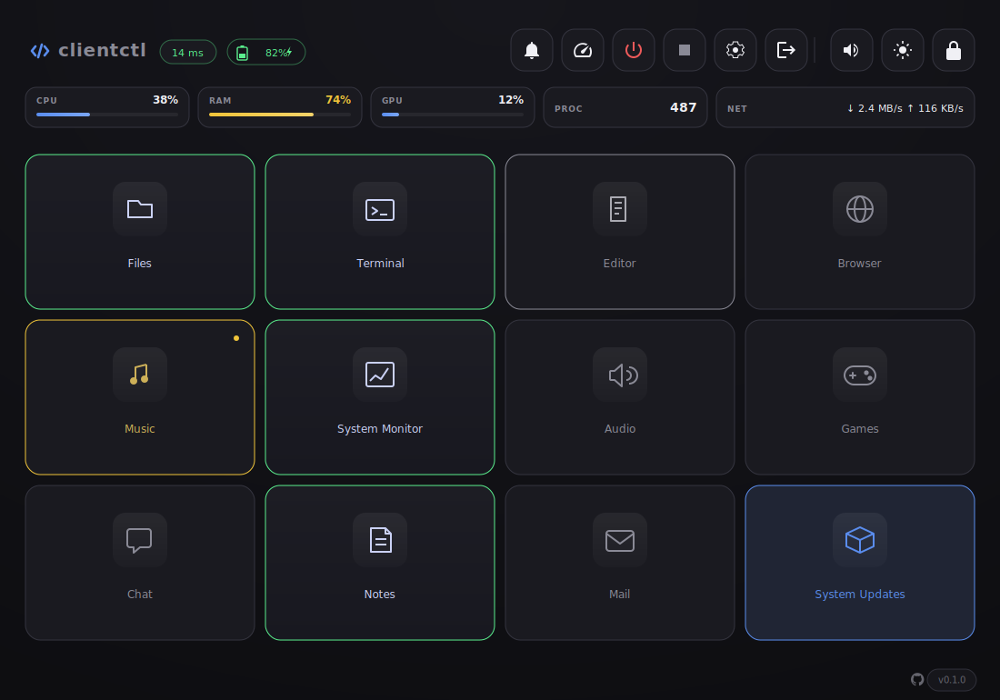
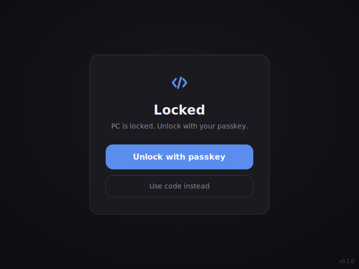
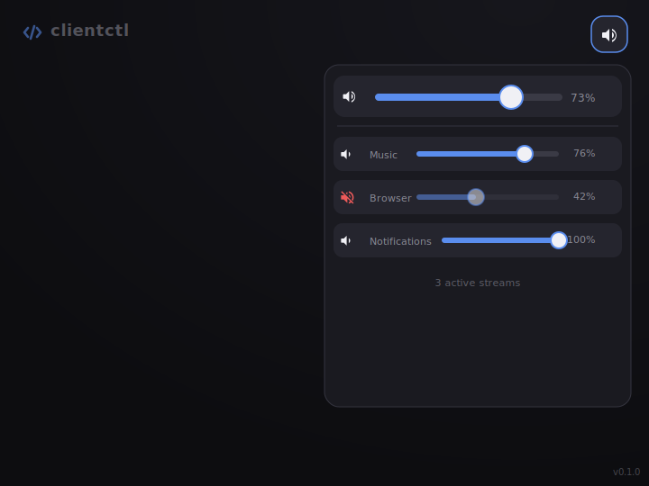
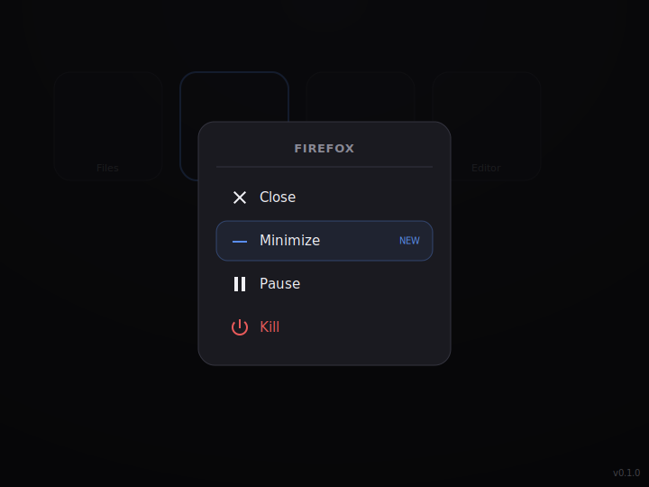
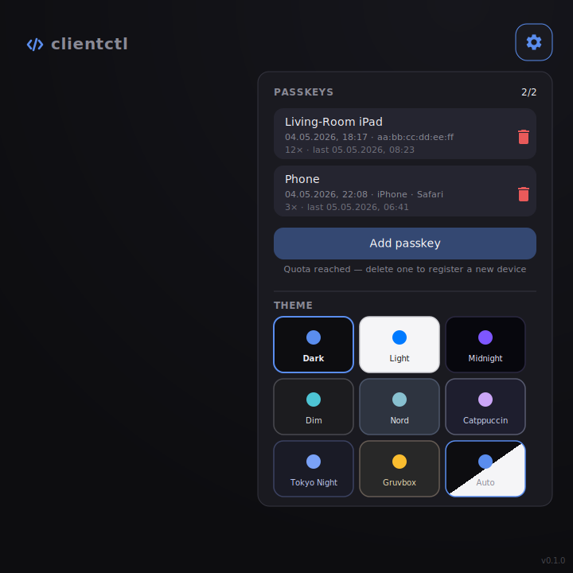

# clientctl


Web-based control panel for a Linux **desktop or laptop** — operate it
from any device with a browser. Run it on your daily-driver PC, a
home-lab box, or a headless workstation: the UI works the same way.
Local on the LAN, dev-only on localhost, or remote via a Cloudflare
tunnel.

Tuned for KDE Plasma 6 / Wayland, but thanks to capability detection it
also runs on other distributions — features the running system does not
support are simply hidden in the UI.

<p align="center">
  
</p>

<p align="center">
  <em>Illustrative mockup — 4×3 app grid, live CPU/RAM/GPU/PROC/NET stats, header with ping + battery.</em>
</p>

<details>
<summary>More views</summary>

<table>
  <tr>
    <td></td>
    <td></td>
  </tr>
  <tr>
    <td align="center"><sub>Lock-screen overlay (biometric unlock via passkey)</sub></td>
    <td align="center"><sub>Audio dropdown — master + per-app sliders, mute states</sub></td>
  </tr>
  <tr>
    <td></td>
    <td></td>
  </tr>
  <tr>
    <td align="center"><sub>Long-press menu — close / minimize / pause / kill</sub></td>
    <td align="center"><sub>Settings — passkey list with device identification + theme picker</sub></td>
  </tr>
</table>

</details>


## Features

- **App grid** with toggle, long-press menu (close / minimize / pause / kill)
- **Live state per cell**: active (green), background (grey), paused (yellow)
- **Header**: ping, battery
- **Stats row**: CPU / RAM / GPU / PROC / NET with progress bars
- **Audio dropdown**: master + per-app stream sliders with mute
- **Brightness dropdown**: per display (KDE PowerManagement / DDC/CI)
- **Power profiles**: cycle through power-saver / balanced / performance
- **Do not disturb**: Plasma DND + freedesktop Notifications.Inhibit
- **Notification history** in dropdown (live capture via `dbus-monitor`)
- **Cachy-Update cell** shows tray icon + opens konsole with `arch-update`
- **Lock / shutdown / server-kill / sign-out** as system buttons
- **Auto-lock**: when the PC locks, the panel locks too
- **Passkey login** (WebAuthn) — up to 2 devices per setup password
- **Cloudflare tunnel** for remote access with HTTPS
- **Touch-optimised**: no zoom, long-press menu, frosted-glass toast
- **8 themes + Auto** (Dark / Light / Midnight / Dim / Nord / Catppuccin / Tokyo Night / Gruvbox + Auto-follow OS) — switchable per device, persisted in localStorage
- **Live state via Server-Sent Events** — sysinfo / battery / lock-state pushed instead of polled (~10× less request volume)
- **Installable PWA** — manifest + service worker, "Add to Home Screen" gives a standalone-app experience with offline shell
- **Feature opt-out** — `CLIENTCTL_DISABLE_FEATURES=audio,gpu,…` hides any detected capability you don't want surfaced
- **Hardened by default** — rate-limited auth, constant-time secret
  comparison, strict CSP + Permissions-Policy, HttpOnly + SameSite cookies,
  CodeQL / Bandit / pip-audit / TruffleHog in CI

## Setup

```bash
git clone https://github.com/Rockykln/clientctl.git
cd clientctl
python -m venv .venv
. .venv/bin/activate
pip install -r requirements.txt
cp .env.example .env       # set setup password + RP_ID
# apps.yml and cloudflared.yml are auto-created from the *.example.yml
# files on first launch.
```

Minimal `.env`:
```env
PASSKEY_REGISTRATION_PASSWORD=<36-char-random>
RP_ID=clientctl.example.com
```

For Intel iGPU stats (optional, one-time):
```bash
sudo setcap cap_perfmon+ep /usr/bin/intel_gpu_top
```

## Configuration

Three separate config files — all gitignored, so private data never ends
up in the repo while every fork can plug in their own values:

| File                | Purpose                              | Example file              |
|---------------------|--------------------------------------|---------------------------|
| `.env`              | Setup password, RP_ID, port          | `.env.example`            |
| `apps.yml`          | App list + grid order                | `apps.example.yml`        |
| `cloudflared.yml`   | Tunnel ID + credentials              | `cloudflared.example.yml` |

`apps.example.yml` uses `~/.local/...` paths (expanded at load time).
Per-app fields: `name`, `cmd`, `desktop_file`, `binary`, `pwa_id`,
`desktop_id`, `wm_class`, `caption_includes`, `cmdline_match`, `icon`.
The trailing `grid:` list defines cell order (4×3 = 12 slots, `cachy` is
a special cell).

## Run

clientctl supports **three deployment modes**, picked via
`CLIENTCTL_MODE`:

| Mode     | Bind          | Tunnel | When to use |
|----------|---------------|--------|-------------|
| `dev`    | `127.0.0.1`   | off    | Hacking on the code, only the host can reach it |
| `lan`    | `0.0.0.0` (LAN) | off  | Default. Reachable from your phone/laptop on the same network |
| `tunnel` | `127.0.0.1`   | **on** | Public HTTPS via your Cloudflare tunnel |

```bash
./start.sh                              # default: lan mode
CLIENTCTL_MODE=dev    ./start.sh        # localhost only, no tunnel
CLIENTCTL_MODE=tunnel ./start.sh        # tunnel + bind to localhost
CLIENTCTL_PORT=8091   ./start.sh        # alternative port (any mode)
```

The console prints the 6-digit login code, valid 10 minutes. Need a
fresh code without restarting? Send `SIGUSR1` to the server process —
`kill -USR1 <pid>` and the console prints a new one.

Closing the terminal stops the server + tunnel via the trap.

### Intel iGPU stats

clientctl runs `intel_gpu_top -J -s 1000` as a daemon to read the
**Render/3D engine busy %** for the GPU pill in the header. The reading
covers the actual rasteriser load — separate samples for Blitter,
Video, VideoEnhance are merged via `max()` so the pill reflects whichever
engine is currently busy.

`intel_gpu_top` needs `CAP_PERFMON`. Granted once with:

```bash
sudo setcap cap_perfmon+ep /usr/bin/intel_gpu_top
```

Re-apply this after upgrading `intel-gpu-tools` (the cap is dropped on
package replace). On AMD systems we fall back to
`/sys/class/drm/cardN/device/gpu_busy_percent` (no setcap needed); on
NVIDIA the cell pulls from `nvidia-smi --query-gpu=utilization.gpu`.

## Deployment

Three install patterns are shipped as templates in [examples/](examples/):

| Method | When to use |
|--------|-------------|
| [`examples/clientctl.desktop`](examples/clientctl.desktop) | Desktop / app-menu icon. Runs in a terminal so you can see the login code. |
| [`examples/clientctl.service`](examples/clientctl.service) | systemd user service. Auto-starts on login, runs headless. |
| [`examples/clientctl-tunnel.service`](examples/clientctl-tunnel.service) | Companion service for the Cloudflare tunnel. Tied to the main service. |

See [examples/README.md](examples/README.md) for one-liner install commands.

## Login

1. Use the **6-digit code** from the console banner — valid 10 min after start
2. After login, a session cookie is set: **7 days** by default, **14 days**
   when "Remember me" is ticked. Tunable via `CLIENTCTL_SESSION_TTL_DAYS`
   and `CLIENTCTL_SESSION_REMEMBER_DAYS` in `.env`.
3. Optional: add a passkey via the settings gear (biometric unlock on
   supported devices — once added the code is only needed if the
   passkey is removed)
4. Code expired? Send `SIGUSR1` to the server (`kill -USR1 <pid>`) to
   regenerate without restarting; the new code is printed to the
   console.

## Architecture

```
clientctl/
├── server.py                # Flask entry: capabilities + register blueprints
├── config.py                # .env loading, apps.yml, constants
│
├── core/                    # Backend (hardware/system integration)
│   ├── kwin.py              #   KWin scripting + window-state cache
│   ├── procs.py             #   /proc-based process index (cached 0.8s)
│   ├── notifications.py     #   dbus-monitor listener
│   ├── intel_gpu.py         #   intel_gpu_top streaming parser
│   ├── audio.py             #   wpctl + pactl wrapper
│   ├── displays.py          #   KDE brightness + ddcutil
│   ├── system.py            #   Power profile, DND, battery, sysinfo
│   ├── themes.py            #   themes.yml loader → /themes.css
│   └── cachy.py             #   arch-update tray integration
│
├── routes/                  # Flask blueprints (HTTP layer)
│   ├── auth.py              #   /api/login, /api/passkey/*, /api/lock, /api/status
│   ├── apps.py              #   /api/app/*, /api/apps/*
│   ├── audio.py             #   /api/volume, /api/audio/*
│   ├── displays.py          #   /api/displays, /api/brightness/*
│   ├── system.py            #   /api/power, /api/notif, /api/sysinfo, /api/capabilities
│   └── cachy.py             #   /api/cachy/*
│
├── utils/                   # Generic helpers
│   ├── shell.py             #   subprocess wrapper with defaults
│   ├── encoding.py          #   base64url
│   ├── auth.py              #   is_authed, require_auth decorator
│   └── caps.py              #   Capability detection
│
├── static/
│   ├── index.html           # UI: login + lock + app-grid + stats row
│   ├── style.css            # Theme-aware, touch-friendly
│   ├── app.js               # WebAuthn, polling, long-press, dynamic grid
│   ├── theme-bootstrap.js   # Inline-script-free FOUC prevention (CSP-clean)
│   └── favicon.svg
│
├── state/                   # gitignored, persistent
│   ├── secret.key           #   Flask session secret (survives restart)
│   └── passkeys.json        #   Registered WebAuthn public keys (chmod 600)
│
├── apps.yml                 # gitignored — your local app list
├── apps.example.yml         #            — template in repo
├── themes.yml               # gitignored — your colour palettes
├── themes.example.yml       #            — template (5 built-in themes)
├── cloudflared.yml          # gitignored — your tunnel config
├── cloudflared.example.yml  #            — template in repo
├── .env                     # gitignored — secrets
├── .env.example             #            — template in repo
├── tests/                   # pytest suite (hermetic, no KDE required)
├── docs/screenshots/        # SVG mockups used in README
├── examples/                # .desktop launcher + systemd user services
├── .github/                 # CI workflows, dependabot, issue + PR templates
├── start.sh                 # Launcher: server + cloudflared, auto-init
├── requirements.txt
├── requirements-dev.txt     # adds pytest + pytest-cov
├── pyproject.toml           # pytest + coverage + project metadata
├── CHANGELOG.md
├── SECURITY.md
├── LICENSE
└── README.md
```

## Themes

Five themes ship out of the box, switchable via the settings dropdown
(top-right gear icon). The choice persists per-device in `localStorage`,
so your phone and your laptop can use different themes against the same
server.

| Theme    | Vibe                                            |
|----------|-------------------------------------------------|
| Dark     | Default. iOS-style deep neutral.                |
| Light    | Clean, high-contrast.                           |
| Midnight | Deep purple, accent: violet.                    |
| Dim      | Soft greys, lower contrast for long sessions.   |
| Nord     | Frosty blue, [Nord palette](https://www.nordtheme.com/). |

### Adding or editing themes

Themes live in `themes.yml` (auto-created from
[themes.example.yml](themes.example.yml) on first run, gitignored).

1. Open `themes.yml`.
2. Copy one of the existing blocks and rename the key.
3. Adjust the colour palette — every key from `bg` through `toast-border`
   must be present.
4. Restart the server **OR** `POST /api/themes/reload` to pick up the
   change without a restart. The picker rebuilds itself on next load.

Schema is validated by [core/themes.py](core/themes.py); themes with
missing palette keys are skipped with a warning.

The test suite enforces that every theme defines the exact same set of
variables and that each registered theme has a matching CSS block.

## Tests

```bash
pip install -r requirements-dev.txt
pytest                  # run the suite
pytest --cov            # with coverage report
```

The suite runs hermetically — system calls (`subprocess`, `/proc`,
`busctl`, `qdbus6`, …) are patched, so it passes on any Linux box, in
Docker, and in CI without a desktop session. CI is wired up via
[GitHub Actions](.github/workflows/test.yml) on Python 3.11 / 3.12 / 3.13.

Areas covered: base64url encoding, /proc-based PID matching, capability
detection, apps.yml loading + path expansion, Flask auth flow, all route
guards, KWin window-matcher logic, intel_gpu_top streaming parser.

System-integration code (DBus calls, KWin scripting, wpctl/pactl, etc.)
is not unit-tested — it requires a real KDE Plasma session and is
verified manually.

## Multi-distro support

At startup `utils/caps.py` checks which tools/backends are available.
The result is exposed via `/api/capabilities`. Buttons in the HTML with
`data-cap="X"` are hidden when capability `X` is missing:

| Capability        | Meaning                                     |
|-------------------|---------------------------------------------|
| `kde_plasma`      | qdbus6 + KWin DBus reachable                |
| `kde_brightness`  | Laptop backlight via KDE PowerManagement    |
| `ddc`             | External monitors via ddcutil               |
| `audio`           | `pipewire` (wpctl), `pulse` (pactl), `none` |
| `battery`         | UPower DisplayDevice IsPresent              |
| `power_profiles`  | net.hadess.PowerProfiles reachable          |
| `logind`          | systemd-logind / loginctl                   |
| `gpu`             | `amd` (sysfs), `intel` (intel_gpu_top), `nvidia` (nvidia-smi), `none` |
| `dbus_monitor`    | dbus-monitor binary present                 |
| `cachy`           | `~/.local/state/arch-update` exists         |

### Tested distributions

The current code path has been verified on:

| Distribution family   | Notes                                                       |
|-----------------------|-------------------------------------------------------------|
| **Arch / Arch-based** | CachyOS, EndeavourOS, Manjaro etc. — same package names, full feature set when KDE Plasma 6 is installed |
| **Debian / Ubuntu**   | Should work but `intel-gpu-tools` package is named `intel-gpu-tools` (binary `intel_gpu_top`); KDE 6 lands on Debian 13+ |
| **Fedora**            | Same, package name `igt-gpu-tools` provides the binary    |
| **openSUSE**          | Plasma 6 in Tumbleweed, Leap users may stay on Plasma 5    |

Capability detection is the truth — anything missing is hidden, the
panel keeps working with reduced features. CachyOS is a regular
Arch-based distro, no special-casing in the code.

On non-KDE systems the notification / power / brightness buttons
disappear; the app grid stays usable (launch + kill work without KWin,
only window toggling does not).

## Performance

- **/proc scan instead of pgrep cascade**: 11 apps × 3 pgrep subprocesses
  per tick became a single `/proc` walk (cached 0.8s) — about 30× faster.
- **KWin state cache**: 0.4s TTL — animations/toggles stay smooth.
- **Threaded Flask**: slow KWin/journalctl calls don't block parallel requests.
- **Live polling intervals**: apps 1.5s, battery 5s, sysinfo 2s, lock 3s.

## Endpoints (selection)

### Auth / status
| Method | Path | Purpose |
|--------|------|---------|
| GET  | `/api/status` | `{authed, screen_locked, passkey_count}` |
| GET  | `/api/ping`   | 204, used for latency measurement |
| GET  | `/api/capabilities` | Which features are available? |
| POST | `/api/login` | `{code}` → session cookie |
| POST | `/api/logout` | Clears the session |
| POST | `/api/passkey/register/begin /finish` | WebAuthn registration |
| POST | `/api/passkey/auth/begin /finish` | Passkey login + auto-unlock |
| GET  | `/api/passkey/list` | Registered passkeys |

### System
| Method | Path | Purpose |
|--------|------|---------|
| GET | `/api/sysinfo` | CPU/RAM/GPU/PROC/NET |
| GET | `/api/battery` | Battery level + charge state |
| GET/POST | `/api/notif/state /toggle /list /clear` | DND + notification history |
| GET/POST | `/api/power/state /cycle` | Power profile |
| POST | `/api/lock /unlock` | logind |
| POST | `/api/shutdown` | KDE dialog (fallback: logind poweroff) |
| POST | `/api/server/kill` | Stop clientctl server |

### Audio / display
| Method | Path | Purpose |
|--------|------|---------|
| GET/POST | `/api/volume` | Master volume |
| GET | `/api/audio/streams` | Per-app sink-inputs |
| POST | `/api/audio/stream/<id>` | Per-app volume / mute |
| GET | `/api/displays` | Displays + brightness |
| POST | `/api/brightness/<id>` | Set brightness |

### Apps
| Method | Path | Purpose |
|--------|------|---------|
| GET | `/api/apps/list` | Grid order + display names |
| GET | `/api/apps/status` | Batch status of all apps |
| GET | `/api/app/<id>/status /icon` | Single status / icon |
| POST | `/api/app/<id>/toggle /close /pause /kill` | App actions |
| GET/POST | `/api/cachy/state /icon /run` | Cachy update cell |

## Tech notes

- **KWin window state** via JS script → JSON in journalctl with marker →
  server reads with retry loop. PWAs are detected purely via KWin
  (Chromium shares one parent process for multiple PWAs).
- **Notification capture** via a `dbus-monitor` daemon thread; parses
  `Notify` multi-line output. In-memory deque of the last 30.
- **DND on two paths**: `kwriteconfig6 plasmanotifyrc --notify` +
  freedesktop `Notifications.Inhibit`.
- **Sessions** survive server restart (persistent `secret.key`).
- **WebAuthn challenges** stored server-side keyed by token (not Flask
  session) — robust against cookie issues between begin/finish.

## Troubleshooting

- **Page does not load via Cloudflare**: Cloudflare Rocket Loader rewrites
  `<script>` tags — the relevant scripts carry `data-cfasync="false"`.
- **Icons missing**: check the paths in `apps.yml` (`~` and `$HOME` are expanded).
- **DND not visually active**: Plasma's UI does not always re-read live.
  Notifications are still suppressed via the inhibitor — verify with
  `notify-send test test`.
- **App missing from grid**: the entry must be in `apps:` AND in `grid:`
  of `apps.yml`.

## License

MIT — see [LICENSE](LICENSE).

## Privacy

clientctl runs entirely on your machine. It does not phone home, send
analytics, or talk to any third-party service except the ones you
explicitly configure (e.g. Cloudflare for the optional tunnel).
All state — passkeys, session secret, settings — lives in `state/` on
your local disk and is never uploaded.

The bundled `dbus-monitor` capture reads notifications already shown on
your desktop; it doesn't subscribe to private channels and the buffer
is in-memory only (last 30, cleared on restart).

## Built with

- [Flask](https://flask.palletsprojects.com/) — HTTP framework
- [py_webauthn](https://github.com/duo-labs/py_webauthn) — WebAuthn / passkey
  registration & verification
- [psutil](https://github.com/giampaolo/psutil) — CPU/RAM/network sampling
- [PyYAML](https://pyyaml.org/) — `apps.yml` parsing
- [python-dotenv](https://github.com/theskumar/python-dotenv) — `.env` loading

System integration: KWin (KDE), `qdbus6`, `kwriteconfig6`, `wpctl`/`pactl`,
`ddcutil`, `intel_gpu_top`, `dbus-monitor`, `loginctl`.

## Contributing

Bug reports, ideas, and PRs welcome. See [CONTRIBUTING.md](CONTRIBUTING.md)
for the dev setup, test workflow, and conventions.

## Trademarks

clientctl integrates with various third-party software and may reference
the following trademarks for descriptive purposes only:

- **KDE®** and **Plasma®** are registered trademarks of KDE e.V.
- **Cloudflare®** is a registered trademark of Cloudflare, Inc.
- **Intel®** is a registered trademark of Intel Corporation.
- **AMD®** is a registered trademark of Advanced Micro Devices, Inc.
- **NVIDIA®** is a registered trademark of NVIDIA Corporation.
- **Arch Linux™** and **CachyOS™** are trademarks of their respective owners.

This project is an independent work. It is **not affiliated with,
endorsed by, or sponsored by** any of the above. All other trademarks are
the property of their respective owners.
